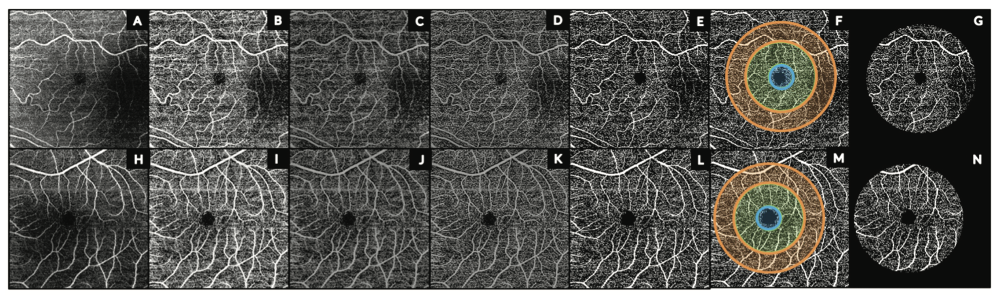

## Retinal imaging biomarkers in psychotic disorders
During my time at Beth Israel Deaconess Medical Center (BIDMC), I mainly worked on projects trying to uncover and understand retinal biomarkers in
psychotic disorders. Visual disturbances are commonly reported in patients with psychosis, and research has increasingly shown that the [retina may provide key insights](https://academic.oup.com/schizophreniabulletin/article/47/3/577/6144974#google_vignette) into the pathophysiology of these disorders. 

One of my main contributions was the development of a semi-automated pipeline (repo coming soon) to more accurately and efficiently extract microvascular
morphology measures from optical coherence tomography angiography (OCTA) images. Additionally, this pipeline allowed for better analysis between structural
OCT measures and microvascular data from OCTA scans. 

  

*Figure 1 from Bannai et. al 2021, Schizophrenia Bull. Depicts flow of semi-automated pipeline in eyes from a healthy control (top row) and patient (bottom row).

## Publications
[**Quantifying Retinal Microvascular Morphology in Schizophrenia Using Swept-Source Optical Coherence Tomography Angiography**](https://dbannai.github.io/files/2021-09-23-ss-octa-ret.pdf)

[**Retinal Layer Abnormalities and Their Association with Clinical and Brain Measures in Psychotic Disorders: A Preliminary Study**](https://dbannai.github.io/files/2020-02-27-ret-structural-prelim.pdf)

[**A Meta-analysis of Retinal Cytoarchitectural Abnormalities in Schizophrenia and Bipolar Disorder**](https://dbannai.github.io/files/2019-05-21-meta-analysis-sz-bd.pdf)
